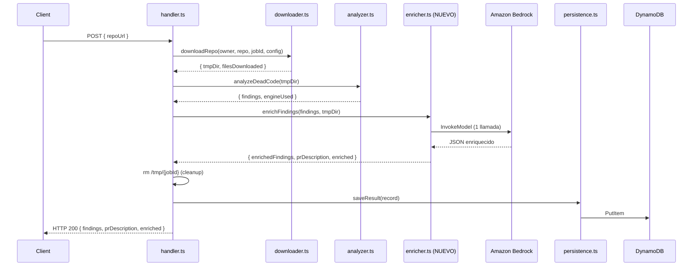

# Documento de Diseño — Enriquecimiento con Amazon Bedrock (Día 2)

## Overview

Este diseño cubre la **Capa de Enriquecimiento** (Requirement 8) que se añade al pipeline existente de DeadCode Radar. El sistema del Día 1 ya descarga repos, ejecuta knip y persiste hallazgos. El Día 2 inserta un paso intermedio entre análisis y limpieza de `/tmp` que invoca Amazon Bedrock para enriquecer los hallazgos crudos con:

- **confidenceScore** (high/medium/low): certeza de que es realmente código muerto
- **riskExplanation**: explicación en lenguaje natural del riesgo de eliminación
- **groupId**: agrupación lógica de hallazgos relacionados
- **prDescription**: título y cuerpo de PR sugerida

El diseño prioriza **resiliencia**: si Bedrock falla por cualquier razón, el pipeline retorna los hallazgos sin enriquecer (nunca falla el análisis completo).

---

## Architecture

### Pipeline Modificado (Día 2)




### Cambios Estructurales al Pipeline Existente

| Aspecto | Día 1 (actual) | Día 2 (modificado) |
|---------|----------------|---------------------|
| Orden post-análisis | análisis → cleanup /tmp → persist | análisis → **enrich** → cleanup /tmp → persist |
| Timeout knip | 240s individual por intento | **Presupuesto global 180s** (120s knip + hasta 60s ts-prune) |
| Respuesta HTTP | `{ jobId, status, findings, ... }` | `{ ..., enriched, prDescription, findings[].confidenceScore, ... }` |
| Env vars Lambda | GITHUB_TOKEN, TABLE_NAME | + **BEDROCK_INFERENCE_PROFILE_ID** |
| IAM | dynamodb:Read/Write | + **bedrock:InvokeModel** |

### Decisiones de Diseño Clave

1. **Una sola llamada a Bedrock**: Enviar todos los hallazgos (máx 50) en un solo prompt reduce latencia y costo vs. N llamadas individuales.
2. **Fallback graceful**: El enriquecimiento es best-effort; un fallo de Bedrock nunca impide retornar los hallazgos crudos del análisis estático.
3. **Timeout independiente de 60s**: Previene que Bedrock consuma el presupuesto completo de 5 min de la Lambda.
4. **Archivos disponibles durante enriquecimiento**: Mover `rm /tmp` después de enrichment permite leer contexto de código fuente para el prompt.

---

## Components and Interfaces

### Nuevo Módulo: `lambda/enricher.ts`

```typescript
// === Interfaces de entrada/salida ===

export interface EnrichmentInput {
  findings: Finding[];
  tmpDir: string;
}

export interface EnrichmentResult {
  findings: EnrichedFinding[];
  prDescription: PrDescription | null;
  enriched: boolean;
}

// === Función principal ===

/**
 * Enriquece hallazgos de código muerto usando Amazon Bedrock.
 * Si Bedrock falla por cualquier razón, retorna hallazgos con campos null (fallback).
 * 
 * @param input - Hallazgos crudos y directorio temporal con archivos fuente
 * @returns Hallazgos enriquecidos + descripción de PR + flag de estado
 */
export async function enrichFindings(input: EnrichmentInput): Promise<EnrichmentResult>;
```


### Funciones Internas de `enricher.ts`

```typescript
/**
 * Selecciona los primeros 50 hallazgos ordenados por `file` para enriquecimiento.
 * Los restantes se retornan con campos de enriquecimiento en null.
 */
function selectFindingsForEnrichment(findings: Finding[]): {
  selected: Finding[];
  remaining: Finding[];
};

/**
 * Lee el contexto de archivo para cada hallazgo seleccionado.
 * Extrae ±15 líneas alrededor de la línea señalada (o primeras 30 líneas si line=null).
 * Respeta el límite total de 100K caracteres, truncando archivos según sea necesario.
 */
function buildFileContext(
  findings: Finding[],
  tmpDir: string
): Promise<FindingWithContext[]>;

/**
 * Construye el payload de mensajes (system + user) para la API de Bedrock.
 */
function buildPromptMessages(
  findingsWithContext: FindingWithContext[]
): { system: string; user: string };

/**
 * Invoca Amazon Bedrock con timeout de 60s usando AbortController.
 * Retorna el texto de respuesta del modelo o lanza error en timeout/falla.
 */
async function invokeBedrockWithTimeout(
  system: string,
  user: string
): Promise<string>;

/**
 * Parsea y valida la respuesta JSON de Bedrock contra el esquema esperado.
 * Lanza error si la respuesta no es JSON válido o no cumple el esquema.
 */
function parseBedrockResponse(
  raw: string,
  selectedFindings: Finding[]
): { enrichedFindings: EnrichedFinding[]; prDescription: PrDescription };

/**
 * Aplica el fallback: retorna todos los findings con campos de enriquecimiento en null.
 */
function applyFallback(findings: Finding[]): EnrichmentResult;
```

### Módulo Modificado: `lambda/handler.ts`

Cambios al `handlePost`:

```typescript
// Día 2: El try/finally se reestructura para mover cleanup DESPUÉS de enrichment

// Paso 1: Descargar repositorio
const downloadResult = await downloadRepo(owner, repo, jobId, config);

try {
  // Paso 2: Analizar código muerto
  const analysisResult = await analyzeDeadCode(downloadResult.tmpDir);

  // Paso 3 (NUEVO): Enriquecer hallazgos con Bedrock
  const enrichmentResult = await enrichFindings({
    findings: analysisResult.findings,
    tmpDir: downloadResult.tmpDir,
  });

  // Paso 4: Construir y persistir registro
  const record: JobRecord = {
    jobId,
    repoUrl,
    status: "completed",
    findings: enrichmentResult.findings,
    createdAt: new Date().toISOString(),
    filesAnalyzed: downloadResult.filesDownloaded,
    enriched: enrichmentResult.enriched,
    prDescription: enrichmentResult.prDescription,
  };

  await saveResult(record);

  // Paso 5: Retornar respuesta
  return {
    response: buildResponse(200, {
      jobId,
      status: "completed",
      repoUrl,
      filesAnalyzed: downloadResult.filesDownloaded,
      enriched: enrichmentResult.enriched,
      findings: enrichmentResult.findings,
      prDescription: enrichmentResult.prDescription,
    }),
    jobId,
  };
} finally {
  // Paso 4 (reubicado): Limpiar /tmp DESPUÉS de enrichment
  await rm(`/tmp/${jobId}`, { recursive: true, force: true }).catch(() => {});
}
```


### Módulo Modificado: `lambda/persistence.ts`

Cambios a `saveResult` y `getResult` para manejar los nuevos campos:

```typescript
// En saveResult — añadir campos de enriquecimiento al item DynamoDB:
if (record.enriched !== undefined) {
  item.enriched = { BOOL: record.enriched };
}
if (record.prDescription) {
  item.prDescription = { S: JSON.stringify(record.prDescription) };
}
// findings ya incluye los campos enriched (confidenceScore, riskExplanation, groupId)
// porque se serializan como JSON string en el campo findings existente

// En getResult — leer campos adicionales:
if (item.enriched?.BOOL !== undefined) {
  record.enriched = item.enriched.BOOL;
}
if (item.prDescription?.S) {
  record.prDescription = JSON.parse(item.prDescription.S);
}
```

### Módulo Modificado: `lambda/analyzer.ts`

Cambio crítico: reemplazar el timeout individual por un **presupuesto global compartido** de 180s para toda la fase de análisis (knip + fallback combinados). Knip recibe 120s; si falla por razón distinta a timeout, ts-prune recibe el tiempo remanente (máx 60s). Esto garantiza que el peor caso real sea 180s, no 360s.

```typescript
/** Presupuesto GLOBAL para toda la fase de análisis (knip + fallback combinados). */
const ANALYSIS_BUDGET_MS = 180_000;

/** Porción del presupuesto asignada a knip como motor primario. */
const KNIP_TIMEOUT_MS = 120_000;

/**
 * Analiza código muerto con presupuesto de tiempo compartido.
 * - knip: hasta 120s
 * - ts-prune (fallback): tiempo restante del presupuesto (máx ~60s)
 * - Si ambos agotan el presupuesto total → ANALYSIS_ENGINE_FAILED
 */
export async function analyzeDeadCode(tmpDir: string): Promise<AnalysisResult> {
  const budgetStart = Date.now();

  // Intentar con knip primero (120s max)
  const knipBin = resolveKnipBin();
  if (knipBin) {
    try {
      const findings = runKnip(knipBin, tmpDir, KNIP_TIMEOUT_MS);
      return { findings, engineUsed: "knip" };
    } catch (knipError) {
      if (knipError instanceof AppError && knipError.type === ErrorType.ANALYSIS_TIMEOUT) {
        // knip agotó su timeout — verificar si queda presupuesto para fallback
        const elapsed = Date.now() - budgetStart;
        const remaining = ANALYSIS_BUDGET_MS - elapsed;
        if (remaining <= 5_000) {
          // Menos de 5s restantes — no tiene sentido intentar fallback
          throw new AppError(
            ErrorType.ANALYSIS_ENGINE_FAILED,
            "Presupuesto de análisis agotado tras timeout de knip, sin margen para fallback"
          );
        }
        // Intentar fallback con el tiempo restante
        console.warn(`knip timeout after ${elapsed}ms, attempting ts-prune with ${remaining}ms remaining`);
      } else {
        console.error("knip failed, attempting ts-prune fallback:", 
          knipError instanceof Error ? knipError.message : String(knipError));
      }
    }
  }

  // Fallback: ts-prune con tiempo restante del presupuesto
  const elapsed = Date.now() - budgetStart;
  const remainingBudget = Math.max(0, ANALYSIS_BUDGET_MS - elapsed);

  if (remainingBudget <= 5_000) {
    throw new AppError(
      ErrorType.ANALYSIS_ENGINE_FAILED,
      `Presupuesto de análisis agotado (${elapsed}ms consumidos), sin margen para ts-prune`
    );
  }

  const tsPruneBin = resolveTsPruneBin();
  if (tsPruneBin) {
    try {
      const findings = runTsPrune(tsPruneBin, tmpDir, remainingBudget);
      return { findings, engineUsed: "ts-prune" };
    } catch (tsPruneError) {
      if (tsPruneError instanceof AppError && tsPruneError.type === ErrorType.ANALYSIS_TIMEOUT) {
        throw new AppError(
          ErrorType.ANALYSIS_ENGINE_FAILED,
          "Presupuesto de análisis agotado: knip + ts-prune excedieron 180s combinados"
        );
      }
      throw new AppError(
        ErrorType.ANALYSIS_ENGINE_FAILED,
        `Both engines failed. ts-prune: ${tsPruneError instanceof Error ? tsPruneError.message : String(tsPruneError)}`
      );
    }
  }

  throw new AppError(
    ErrorType.ANALYSIS_ENGINE_FAILED,
    "No analysis engine available: neither knip nor ts-prune binaries could be resolved"
  );
}

// Las funciones runKnip y runTsPrune ahora reciben timeoutMs como parámetro:
function runKnip(knipBin: string, tmpDir: string, timeoutMs: number): Finding[] { /* ... */ }
function runTsPrune(tsPruneBin: string, tmpDir: string, timeoutMs: number): Finding[] { /* ... */ }
```

### Módulo Modificado: `lib/deadcode-radar-stack.ts`

```typescript
// Añadir variable de entorno
environment: {
  GITHUB_TOKEN: process.env.GITHUB_TOKEN || "",
  TABLE_NAME: table.tableName,
  BEDROCK_INFERENCE_PROFILE_ID: 
    process.env.BEDROCK_INFERENCE_PROFILE_ID || "us.anthropic.claude-sonnet-4-6",
},

// Añadir permiso IAM para Bedrock
import * as iam from "aws-cdk-lib/aws-iam";

handler.addToRolePolicy(new iam.PolicyStatement({
  actions: ["bedrock:InvokeModel"],
  resources: [
    `arn:aws:bedrock:*::foundation-model/*`,
    `arn:aws:bedrock:*:${this.account}:inference-profile/*`,
  ],
}));

// Añadir dependencia en package.json
// "@aws-sdk/client-bedrock-runtime": "^3.712.0"
```

---

## Data Models

### Tipos Nuevos (`lambda/types.ts`)

```typescript
/** Hallazgo enriquecido con metadatos de IA. */
export interface EnrichedFinding extends Finding {
  confidenceScore: "high" | "medium" | "low" | null;
  riskExplanation: string | null;
  groupId: string | null;
}

/** Descripción de PR generada por el Motor_IA. */
export interface PrDescription {
  title: string;   // Máximo 72 caracteres
  body: string;    // Formato Markdown
}
```


### JobRecord Actualizado

```typescript
/** Registro persistido en DynamoDB (Día 2 — campos adicionales opcionales). */
export interface JobRecord {
  jobId: string;
  repoUrl: string;
  status: "completed" | "error";
  findings: EnrichedFinding[];  // Antes: Finding[]
  createdAt: string;
  filesAnalyzed: number;
  errorMessage?: string;
  truncated?: boolean;
  // Día 2: Campos de enriquecimiento
  enriched?: boolean;
  prDescription?: PrDescription | null;
}
```

### Esquema de Respuesta de Bedrock (esperado)

```json
{
  "findings": [
    {
      "index": 0,
      "confidenceScore": "high",
      "riskExplanation": "Este archivo no tiene importaciones entrantes ni exports consumidos por otros módulos.",
      "groupId": "ab12cd34"
    }
  ],
  "prDescription": {
    "title": "chore: remove 5 unused exports and 2 dead files",
    "body": "## Summary\n\n### Unused Files\n- `src/legacy.ts`\n\n### Unused Exports\n..."
  }
}
```

### Tipo Interno: FindingWithContext

```typescript
/** Hallazgo con contexto de archivo adjunto para el prompt. */
interface FindingWithContext {
  finding: Finding;
  index: number;
  fileContent: string;  // Fragmento de contexto (±15 líneas o truncado)
}
```

---

## Estructura del Prompt de Bedrock

### System Prompt

```text
You are a code analysis assistant. Analyze the following dead code findings from a JavaScript/TypeScript repository.

For each finding, provide:
1. confidenceScore: "high", "medium", or "low" — how certain you are this is truly dead code
2. riskExplanation: 1-2 sentences explaining why this is a removal candidate and what risk exists
3. groupId: an 8-character alphanumeric ID shared between related findings (e.g., multiple unused exports from the same file, or an unused file whose exports also appear as findings). Use null if the finding is independent.

Confidence criteria:
- "high": File with no incoming imports and no consumed exports; clearly orphaned code
- "medium": Export that might have dynamic consumers, test-only usage, or conditional imports
- "low": Ambiguous cases — re-exports, plugin patterns, dynamic require/import patterns

Also generate a prDescription object with:
- title: A concise PR title (max 72 characters) summarizing the cleanup
- body: A Markdown-formatted PR body grouping suggested removals by type and file

RESPOND ONLY WITH VALID JSON matching this exact schema:
{
  "findings": [
    { "index": <number>, "confidenceScore": "<high|medium|low>", "riskExplanation": "<string>", "groupId": "<string|null>" }
  ],
  "prDescription": { "title": "<string>", "body": "<string>" }
}

The "index" field must correspond to the 0-based index in the findings array provided in the user message.
```


### User Prompt (construido dinámicamente)

```text
Analyze these {N} dead code findings:

Finding 0:
  File: src/utils/legacy.ts
  Line: 15
  Type: unused-export
  Name: formatDate
  Context:
  ```typescript
  // Lines 1-30 of src/utils/legacy.ts
  import { format } from 'date-fns';
  
  export function formatDate(date: Date): string {
    return format(date, 'yyyy-MM-dd');
  }
  // ... (rest of file context)
  ```

Finding 1:
  File: src/helpers/old-math.ts
  Line: null
  Type: unused-file
  Name: old-math.ts
  Context:
  ```typescript
  // Full file: src/helpers/old-math.ts (28 lines)
  export function add(a: number, b: number) { ... }
  ...
  ```

[... hasta 50 findings con contexto ...]
```

### Estrategia de Truncamiento de Contexto

1. **Selección**: Ordenar findings por `file` alfabéticamente, tomar los primeros 50
2. **Lectura de contexto**: Para cada finding:
   - Si `line` no es null: leer ±15 líneas alrededor de la línea señalada
   - Si `line` es null (archivo completo): leer primeras 30 líneas del archivo
3. **Acumulación con límite**: Iterar los 50 findings acumulando tamaño de contexto
   - Si agregar el contexto del siguiente finding excede 100K chars total: truncar el contenido de ese archivo a lo que quepa
   - Si ya se alcanzó 100K: incluir el finding sin contexto de archivo (solo metadatos)
4. **Hallazgos restantes (>50)**: Se incluyen en la respuesta final con campos null, sin pasar por Bedrock

---

## Correctness Properties

*Una propiedad es una característica o comportamiento que debe ser verdadero en todas las ejecuciones válidas de un sistema — esencialmente, una declaración formal sobre lo que el sistema debe hacer. Las propiedades sirven como puente entre especificaciones legibles por humanos y garantías de correctitud verificables por máquina.*

### Property 1: Inclusión de contexto de archivo en el prompt

*Para cualquier* hallazgo seleccionado para enriquecimiento que tenga un archivo existente en `/tmp/{jobId}`, el prompt construido para Bedrock DEBE contener un fragmento del contenido de ese archivo.

**Validates: Requirements 8.3**

### Property 2: Validación del esquema de respuesta de Bedrock

*Para cualquier* respuesta JSON válida de Bedrock, todos los campos enrichment DEBEN cumplir: `confidenceScore` es exactamente `"high"`, `"medium"` o `"low"`; `groupId` es `null` o un string alfanumérico de exactamente 8 caracteres; `riskExplanation` es un string no vacío; y `prDescription.title` tiene longitud ≤72 caracteres con `prDescription.body` no vacío.

**Validates: Requirements 8.6, 8.7, 8.9, 8.10**


### Property 3: Fallback ante cualquier falla de Bedrock

*Para cualquier* tipo de fallo de Bedrock (error de red, timeout de 60s, respuesta no-JSON, respuesta que no cumple esquema) y *para cualquier* conjunto de hallazgos de entrada, el resultado del enricher DEBE contener exactamente los mismos hallazgos originales con `confidenceScore: null`, `riskExplanation: null`, `groupId: null` y `prDescription: null`, con `enriched: false`.

**Validates: Requirements 8.11, 8.12, 8.21**

### Property 4: Persistencia round-trip de hallazgos enriquecidos

*Para cualquier* JobRecord con campos de enriquecimiento (findings con confidenceScore/riskExplanation/groupId, prDescription y enriched), al persistir en DynamoDB y luego recuperar el registro, todos los campos DEBEN preservarse con valores idénticos. Adicionalmente, *para cualquier* JobRecord legacy (sin campos de enriquecimiento), la recuperación DEBE completarse sin error.

**Validates: Requirements 8.15, 8.16, 8.17**

### Property 5: Límite de selección de 50 hallazgos

*Para cualquier* conjunto de hallazgos con más de 50 elementos, la Capa de Enriquecimiento DEBE seleccionar exactamente los primeros 50 hallazgos cuando se ordenan alfabéticamente por el campo `file` para pasar a Bedrock; los hallazgos restantes DEBEN tener `confidenceScore: null`, `riskExplanation: null` y `groupId: null`.

**Validates: Requirements 8.22**

### Property 6: Límite de payload de 100K caracteres

*Para cualquier* conjunto de hallazgos seleccionados y sus contextos de archivo, el payload total (string user prompt) enviado a Bedrock DEBE tener longitud ≤ 100,000 caracteres.

**Validates: Requirements 8.23**

### Property 7: Semántica del campo enriched

*Para cualquier* resultado de enriquecimiento, el campo `enriched` DEBE ser `true` si al menos un hallazgo tiene `confidenceScore` no-null (incluido el caso de enriquecimiento parcial donde solo 50 de N hallazgos fueron enriquecidos). `enriched` DEBE ser `false` exclusivamente cuando la llamada a Bedrock falló completamente (ningún hallazgo fue enriquecido).

**Validates: Requirements 8.25**

---

## Error Handling

### Estrategia de Resiliencia del Enricher

| Escenario de Error | Comportamiento | Logging |
|---|---|---|
| Bedrock timeout (>60s) | AbortController cancela, aplica fallback | WARNING con duración |
| Bedrock error de red | Catch, aplica fallback | WARNING con error message |
| Bedrock respuesta no-JSON | Catch JSON.parse, aplica fallback | WARNING con primeros 500 chars de respuesta |
| Bedrock respuesta no cumple esquema | Validación falla, aplica fallback | WARNING con detalles de validación |
| Error leyendo archivo de /tmp | Incluir finding sin contexto en prompt | DEBUG con path y error |
| InvokeModel error del modelo (4xx/5xx) | Catch, aplica fallback | WARNING con status code y request-id |


### Implementación del Timeout Independiente

```typescript
import { BedrockRuntimeClient, InvokeModelCommand } from "@aws-sdk/client-bedrock-runtime";

const BEDROCK_TIMEOUT_MS = 60_000;

async function invokeBedrockWithTimeout(system: string, user: string): Promise<string> {
  const client = new BedrockRuntimeClient({});
  const controller = new AbortController();
  const timeoutId = setTimeout(() => controller.abort(), BEDROCK_TIMEOUT_MS);

  const profileId = process.env.BEDROCK_INFERENCE_PROFILE_ID 
    || "us.anthropic.claude-sonnet-4-6";

  try {
    const command = new InvokeModelCommand({
      modelId: profileId,
      contentType: "application/json",
      accept: "application/json",
      body: JSON.stringify({
        anthropic_version: "bedrock-2023-05-31",
        max_tokens: 4096,
        system: system,
        messages: [{ role: "user", content: user }],
      }),
    });

    const response = await client.send(command, {
      abortSignal: controller.signal,
    });

    const responseBody = JSON.parse(new TextDecoder().decode(response.body));
    return responseBody.content[0].text;
  } finally {
    clearTimeout(timeoutId);
  }
}
```

### Función Fallback

```typescript
function applyFallback(findings: Finding[]): EnrichmentResult {
  return {
    findings: findings.map(f => ({
      ...f,
      confidenceScore: null,
      riskExplanation: null,
      groupId: null,
    })),
    prDescription: null,
    enriched: false,
  };
}
```

### Flujo Principal del Enricher con Error Handling

```typescript
export async function enrichFindings(input: EnrichmentInput): Promise<EnrichmentResult> {
  const { findings, tmpDir } = input;

  if (findings.length === 0) {
    return { findings: [], prDescription: null, enriched: false };
  }

  try {
    // 1. Seleccionar max 50 findings ordenados por file
    const { selected, remaining } = selectFindingsForEnrichment(findings);

    // 2. Leer contexto de archivos (con límite de 100K chars)
    const findingsWithContext = await buildFileContext(selected, tmpDir);

    // 3. Construir prompt
    const { system, user } = buildPromptMessages(findingsWithContext);

    // 4. Invocar Bedrock con timeout de 60s
    const rawResponse = await invokeBedrockWithTimeout(system, user);

    // 5. Parsear y validar respuesta
    const parsed = parseBedrockResponse(rawResponse, selected);

    // 6. Combinar enriched + remaining (remaining con campos null)
    const enrichedFindings: EnrichedFinding[] = [
      ...parsed.enrichedFindings,
      ...remaining.map(f => ({
        ...f,
        confidenceScore: null as const,
        riskExplanation: null,
        groupId: null,
      })),
    ];

    return {
      findings: enrichedFindings,
      prDescription: parsed.prDescription,
      enriched: true,
    };
  } catch (error) {
    // Log warning y aplicar fallback
    console.warn(JSON.stringify({
      level: "WARNING",
      component: "enricher",
      message: "Bedrock enrichment failed, applying fallback",
      error: error instanceof Error ? error.message : String(error),
    }));

    return applyFallback(findings);
  }
}
```

---

## Testing Strategy

### Enfoque Dual: Unit Tests + Property Tests

**Librería de Property-Based Testing**: `fast-check` (ya compatible con vitest en el proyecto).

**Dependencia a añadir**: `"fast-check": "^3.22.0"` en devDependencies.

### Unit Tests (example-based)

| Test | Módulo | Valida |
|------|--------|--------|
| Bedrock se invoca exactamente 1 vez | enricher.ts | Req 8.1 |
| System prompt contiene instrucción JSON y esquema | enricher.ts | Req 8.4 |
| Pipeline order: enrich antes de cleanup | handler.ts | Req 8.20 |
| Timeout de 60s activa fallback | enricher.ts | Req 8.21 |
| ANALYSIS_BUDGET_MS es 180_000 y KNIP_TIMEOUT_MS es 120_000 | analyzer.ts | Req 8.24 |
| Env var BEDROCK_INFERENCE_PROFILE_ID leída correctamente | enricher.ts | Req 8.13 |
| CDK stack incluye IAM policy para bedrock:InvokeModel | stack | Req 8.14 |
| Respuesta HTTP incluye enriched:true cuando enriquecido | handler.ts | Req 8.18 |
| Respuesta HTTP incluye enriched:false en fallback | handler.ts | Req 8.19 |


### Property Tests (fast-check, mínimo 100 iteraciones)

| Property | Tag | Ref |
|----------|-----|-----|
| Prompt incluye contexto de archivo para findings con archivo existente | Feature: deadcode-radar, Property 1 | 8.3 |
| Respuesta parseada cumple esquema (confidenceScore, groupId, riskExplanation, prDescription) | Feature: deadcode-radar, Property 2 | 8.6, 8.7, 8.9, 8.10 |
| Cualquier fallo de Bedrock produce fallback con campos null | Feature: deadcode-radar, Property 3 | 8.11, 8.12, 8.21 |
| Persistencia round-trip preserva campos de enriquecimiento y soporta registros legacy | Feature: deadcode-radar, Property 4 | 8.15, 8.16, 8.17 |
| Máximo 50 findings seleccionados para enrichment, resto tiene campos null | Feature: deadcode-radar, Property 5 | 8.22 |
| Payload de user prompt nunca excede 100K caracteres | Feature: deadcode-radar, Property 6 | 8.23 |
| enriched=true sii al menos un finding tiene confidenceScore no-null | Feature: deadcode-radar, Property 7 | 8.25 |

### Configuración de Property Tests

```typescript
import { fc } from "fast-check";

// Cada property test usa mínimo 100 iteraciones
const PBT_CONFIG = { numRuns: 100 };

// Generadores compartidos
const findingArb = fc.record({
  file: fc.stringMatching(/^[a-z][a-z0-9\/\-_.]{1,50}\.(ts|js|tsx|jsx)$/),
  line: fc.option(fc.integer({ min: 1, max: 5000 }), { nil: null }),
  type: fc.constantFrom("unused-export", "unused-file", "unused-dependency"),
  name: fc.string({ minLength: 1, maxLength: 50 }),
});

const findingsArrayArb = fc.array(findingArb, { minLength: 1, maxLength: 200 });
```

### Estructura de Archivos de Test

```
test/
├── unit/
│   ├── enricher.test.ts          (NUEVO)
│   ├── handler.test.ts           (MODIFICAR - pipeline order)
│   ├── persistence.test.ts       (MODIFICAR - campos nuevos)
│   └── ...
└── property/
    ├── enricher.property.test.ts (NUEVO)
    └── persistence.property.test.ts (NUEVO)
```
