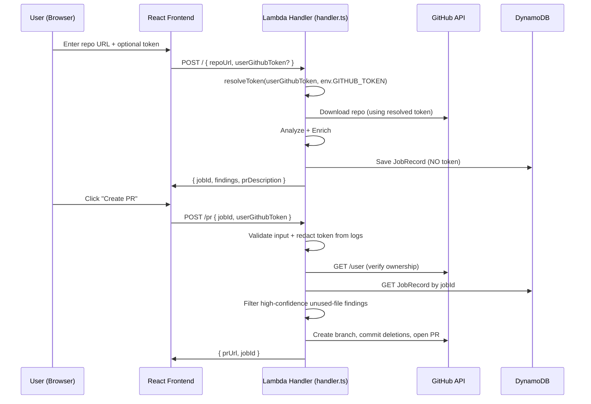
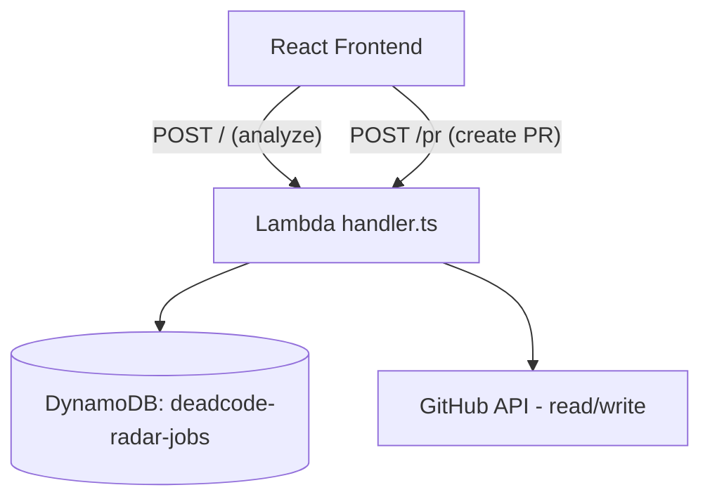

# Design Document: User GitHub Token & PR Creation

## Overview

This feature extends DeadCode Radar to accept a user-provided GitHub Personal Access Token (PAT) at analysis time and uses it to create Pull Requests that remove high-confidence dead code. The design builds on the existing Lambda Function URL architecture, adding a new PR creation handler alongside the existing analysis pipeline.

Key design goals:
- **Token volatility**: The user's token exists only in-memory during a single Lambda invocation and in React state on the frontend. It is never persisted to DynamoDB, logs, or browser storage.
- **Minimal surface area**: The PR endpoint is consolidated into the existing Lambda handler (`lambda/handler.ts`) using path-based routing on the same Function URL — no new Lambda or CDK changes needed.
- **Safety-first PR creation**: Only high-confidence unused-file findings are deleted, and ownership verification gates every PR creation.

## Architecture



### Deployment Topology

The PR endpoint is **consolidated into the existing Lambda handler** (`lambda/handler.ts`) using path-based routing on the same Function URL. Routing is determined by `event.rawPath`:
- `"/"` or `"/analyze"` → existing analysis flow (POST) and query flow (GET)
- `"/pr"` → PR creation flow (POST only)

This avoids deploying a separate Lambda and reuses the same DynamoDB table, IAM role, and Function URL. No CDK changes are required.



## Components and Interfaces

### 1. Token Resolution Utility (`lambda/utils/tokenResolver.ts`)

Pure function that determines which token to use for GitHub operations.

```typescript
/**
 * Resolves which GitHub token to use.
 * Returns userToken if it's a non-empty, non-whitespace string (trimmed, ≤255 chars).
 * Otherwise returns envToken.
 * Throws if userToken exceeds 255 characters.
 */
export function resolveToken(
  userToken: string | null | undefined,
  envToken: string
): { token: string; source: "user" | "env" }

/**
 * Validates the userGithubToken field constraints.
 * Returns error message if invalid, null if valid or absent.
 */
export function validateUserToken(
  token: unknown
): string | null
```

### 2. Token Redaction Utility (`lambda/utils/redactor.ts`)

Prevents accidental token leakage to CloudWatch logs.

```typescript
/**
 * Replaces all occurrences of the token (and any substring of 4+ chars)
 * in the given string with [REDACTED].
 * Returns the original string if token is null/undefined or <4 chars.
 */
export function redact(input: string, token: string | null | undefined): string

/**
 * Creates a safe logger that wraps console.log/console.error,
 * redacting the token from all output.
 */
export function createSafeLogger(token: string | null | undefined): {
  log: (...args: unknown[]) => void
  error: (...args: unknown[]) => void
  warn: (...args: unknown[]) => void
}
```

### 3. Ownership Verification (`lambda/utils/ownershipVerifier.ts`)

Verifies the authenticated user owns the target repository.

```typescript
export interface OwnershipResult {
  verified: boolean
  authenticatedUser?: string
  error?: { statusCode: 401 | 403 | 502; message: string }
}

/**
 * Calls GitHub GET /user with the provided token and compares
 * the authenticated username to the repo owner (case-insensitive).
 * Timeout: 10 seconds.
 */
export async function verifyOwnership(
  token: string,
  repoOwner: string
): Promise<OwnershipResult>
```

### 4. PR Creator (`lambda/prCreator.ts`)

Orchestrates branch creation, file deletions, and PR opening.

```typescript
export interface PrCreationInput {
  token: string
  owner: string
  repo: string
  jobId: string
  filesToDelete: string[]
  prTitle: string
  prBody: string
}

export interface PrCreationResult {
  prUrl: string
  branchName: string
}

/**
 * Creates a branch, commits file deletions, and opens a PR.
 * Branch name: deadcode-radar/cleanup-{first 8 chars of jobId}
 */
export async function createPullRequest(
  input: PrCreationInput
): Promise<PrCreationResult>
```

### 5. PR Handler (`lambda/prHandler.ts`)

Module containing the PR creation logic, called by the main handler when routing to `/pr`.

```typescript
/**
 * Handles POST /pr requests for PR creation.
 * Input: { jobId: string (UUID v4), userGithubToken: string }
 * 
 * Flow:
 * 1. Validate input (JSON, jobId format, token presence/length)
 * 2. Redact token from all logging
 * 3. Retrieve JobRecord from DynamoDB
 * 4. Verify ownership via GitHub GET /user
 * 5. Filter high-confidence unused-file findings
 * 6. Create branch + commit + PR
 * 7. Return { prUrl, jobId }
 */
export async function handlePrCreation(event: LambdaEvent): Promise<LambdaResponse>
```

### 6. Modified Main Handler (`lambda/handler.ts`)

Extends the existing handler to:
1. Route by `event.rawPath`: `"/"` → existing analysis/query flow, `"/pr"` → PR creation
2. Accept `userGithubToken` in the POST body for analysis requests
3. Use `resolveToken()` to determine which token to pass to `downloadRepo()`
4. Wrap all `console.log`/`console.error` calls with `createSafeLogger()`
5. On auth failure from GitHub when using a user token: return error without fallback to env token
6. Delegate `/pr` POST requests to `handlePrCreation()` from `prHandler.ts`

### 7. Frontend Components

#### Token Input (in `testing.tsx`)
- New `useState<string>('')` for `githubToken`
- Collapsible `<details>` section with label and GitHub link
- `<input type="password">` bound to state
- Token included in fetch body when non-whitespace

#### PR Button (enhanced `pr-card.tsx`)
- Receives `githubToken` and `jobId` as props
- Disabled when token is empty/whitespace OR prDescription is null
- Tooltip when disabled explaining requirement
- On click: POST to PR endpoint
- Success state: shows PR link
- Error state: mapped error messages with dismiss

## Data Models

### Request: Analysis Endpoint (extended)

```typescript
interface AnalysisRequest {
  repoUrl: string                    // Required, existing
  userGithubToken?: string           // Optional, max 255 chars
}
```

### Request: PR Endpoint (new)

```typescript
interface PrRequest {
  jobId: string                      // Required, UUID v4
  userGithubToken: string            // Required, non-empty, max 255 chars
}
```

### Response: PR Endpoint - Success (201)

```typescript
interface PrSuccessResponse {
  prUrl: string                      // URL of the created PR
  jobId: string                      // Echo back the jobId
}
```

### Response: PR Endpoint - Errors

| Status | Condition | Body |
|--------|-----------|------|
| 400 | Invalid JSON, missing fields, invalid UUID, empty token | `{ error: string }` |
| 401 | Token invalid or GitHub /user returns 401 | `{ error: string }` |
| 403 | User doesn't own repo or lacks write access | `{ error: string }` |
| 404 | No completed JobRecord for jobId | `{ error: string }` |
| 422 | No high-confidence unused-file findings or null prDescription | `{ error: string }` |
| 502 | GitHub API failure (network, rate limit, branch conflict) | `{ error: string }` |

### JobRecord (unchanged)

The `JobRecord` in DynamoDB remains unchanged. The `userGithubToken` is **never** written to any attribute. The existing schema with `jobId`, `repoUrl`, `status`, `findings`, `createdAt`, `filesAnalyzed`, `enriched`, `prDescription` is sufficient.

### High-Confidence File Filter

```typescript
/**
 * Determines which files are eligible for complete deletion in the PR.
 * A file is a deletion candidate if:
 *   (a) It has at least one finding with type "unused-file" and confidenceScore "high"
 *       (original case — knip explicitly flagged the whole file), OR
 *   (b) ALL findings belonging to that file are type "unused-export" with
 *       confidenceScore "high", AND they all share the same non-null groupId
 *       (this means every export in the file is dead and Bedrock grouped them
 *       as a single logical unit — the file is effectively fully dead code).
 *
 * Any other case (mixed confidence, partial exports dead, no groupId, different
 * groupIds within the same file) → NOT eligible for deletion.
 */
function getFilesToDelete(findings: EnrichedFinding[]): string[] {
  // 1. Group findings by file
  const byFile = new Map<string, EnrichedFinding[]>();
  for (const f of findings) {
    const group = byFile.get(f.file) ?? [];
    group.push(f);
    byFile.set(f.file, group);
  }

  const eligible: string[] = [];

  for (const [file, fileFindings] of byFile) {
    // Case (a): explicit unused-file with high confidence
    const hasUnusedFileHigh = fileFindings.some(
      f => f.type === "unused-file" && f.confidenceScore === "high"
    );
    if (hasUnusedFileHigh) {
      eligible.push(file);
      continue;
    }

    // Case (b): ALL findings are unused-export + high + same non-null groupId
    const allHighExports = fileFindings.every(
      f => f.type === "unused-export" && f.confidenceScore === "high"
    );
    if (!allHighExports || fileFindings.length === 0) continue;

    const firstGroupId = fileFindings[0].groupId;
    if (firstGroupId === null) continue;

    const allSameGroup = fileFindings.every(f => f.groupId === firstGroupId);
    if (allSameGroup) {
      eligible.push(file);
    }
  }

  return eligible;
}
```

#### Worked Examples

**Example 1 — Real fixture: `legacyDateFormatter.ts`**

Input findings:
```json
[
  { "file": "lambda/utils/legacyDateFormatter.ts", "line": 5, "type": "unused-export", "name": "formatLegacyDate", "confidenceScore": "high", "riskExplanation": "...", "groupId": "abc12345" },
  { "file": "lambda/utils/legacyDateFormatter.ts", "line": 12, "type": "unused-export", "name": "parseLegacyTimestamp", "confidenceScore": "high", "riskExplanation": "...", "groupId": "abc12345" }
]
```

Trace:
1. Group by file → `{ "lambda/utils/legacyDateFormatter.ts": [finding1, finding2] }`
2. Case (a): No finding with `type: "unused-file"` → skip
3. Case (b): Both are `unused-export` + `high` ✓. `firstGroupId = "abc12345"` (non-null) ✓. Both share `"abc12345"` ✓.
4. **Result: `["lambda/utils/legacyDateFormatter.ts"]`** → eligible for deletion ✅

**Example 2 — Partial dead file (should NOT be deleted)**

Input findings:
```json
[
  { "file": "src/utils/helpers.ts", "line": 10, "type": "unused-export", "name": "oldHelper", "confidenceScore": "high", "riskExplanation": "...", "groupId": "xyz99999" },
  { "file": "src/utils/helpers.ts", "line": 25, "type": "unused-export", "name": "deprecatedUtil", "confidenceScore": "medium", "riskExplanation": "...", "groupId": "xyz99999" }
]
```

Trace:
1. Group by file → `{ "src/utils/helpers.ts": [finding1, finding2] }`
2. Case (a): No `unused-file` finding → skip
3. Case (b): `allHighExports` check → finding2 has `confidenceScore: "medium"` → **false** ✗
4. **Result: `[]`** → NOT eligible for deletion ✅ (correct: only 1 of 2 exports is high-confidence)

**Example 3 — Mixed groupIds (should NOT be deleted)**

Input findings:
```json
[
  { "file": "src/api/old.ts", "line": 3, "type": "unused-export", "name": "legacyFetch", "confidenceScore": "high", "riskExplanation": "...", "groupId": "aaaa1111" },
  { "file": "src/api/old.ts", "line": 18, "type": "unused-export", "name": "oldTransform", "confidenceScore": "high", "riskExplanation": "...", "groupId": "bbbb2222" }
]
```

Trace:
1. Group by file → `{ "src/api/old.ts": [finding1, finding2] }`
2. Case (a): No `unused-file` finding → skip
3. Case (b): Both `unused-export` + `high` ✓. `firstGroupId = "aaaa1111"`. finding2 has `groupId: "bbbb2222"` ≠ `"aaaa1111"` → **allSameGroup = false** ✗
4. **Result: `[]`** → NOT eligible ✅ (different groups means Bedrock considered them independent units — safer to not delete the whole file)

## Known Risks

### Risk: High-Confidence Unused-File Availability (RESOLVED)

**Original concern**: The pipeline might not produce `type: "unused-file"` + `confidenceScore: "high"` for real repos.

**Validated finding**: Confirmed with real data. Knip does NOT report entire files as `unused-file` in this project's parse format — instead it reports individual exports. However, files that are effectively fully dead (like `legacyDateFormatter.ts`) produce multiple `unused-export` findings with `confidenceScore: "high"` and the same `groupId`.

**Resolution**: The `getFilesToDelete()` logic was extended to cover both cases:
- Case (a): explicit `unused-file` + high (preserved for repos where knip does flag whole files)
- Case (b): ALL exports in a file are `unused-export` + high + same groupId (handles the common real-world pattern)

### Risk: Lambda Function URL rawPath Routing

Lambda Function URLs use [Payload Format 2.0](https://docs.aws.amazon.com/lambda/latest/dg/urls-configuration.html) which includes `rawPath` in the event object. When a client calls `https://<function-url>/pr`, the event contains `rawPath: "/pr"`. This is confirmed by AWS documentation and the Powertools schema definition.

**However**: The current `LambdaEvent` TypeScript interface in `lambda/types.ts` does NOT declare `rawPath`. This must be extended during implementation. The routing approach is sound — no separate Lambda needed.

**Mitigation**: Add `rawPath?: string` to `LambdaEvent` interface. As an extra safety net, the implementation should default to the analysis flow when `rawPath` is undefined or `"/"` (backward compatible).

## Correctness Properties

*A property is a characteristic or behavior that should hold true across all valid executions of a system — essentially, a formal statement about what the system should do. Properties serve as the bridge between human-readable specifications and machine-verifiable correctness guarantees.*

### Property 1: Token Resolution

*For any* input string `userToken` and environment token `envToken`, `resolveToken(userToken, envToken)` SHALL return `{ token: userToken.trim(), source: "user" }` if `userToken` is a non-null string containing at least one non-whitespace character and has length ≤ 255, and SHALL return `{ token: envToken, source: "env" }` otherwise (when `userToken` is null, undefined, empty, or whitespace-only).

**Validates: Requirements 1.1, 1.2**

### Property 2: Token Length Validation

*For any* string `token` with length greater than 255 characters, `validateUserToken(token)` SHALL return a non-null error message. *For any* string `token` with length ≤ 255 that contains at least one non-whitespace character, `validateUserToken(token)` SHALL return null (valid).

**Validates: Requirements 1.3, 6.1**

### Property 3: Token Never Leaks to Output

*For any* non-empty token string `t` (length ≥ 1) and any `JobRecord` or response body object produced by the system during request handling, the JSON-serialized representation of that object SHALL NOT contain the string `t` as a substring.

**Validates: Requirements 1.5, 2.1, 2.2, 2.3, 2.4**

### Property 4: Redaction Completeness

*For any* token string `t` of length ≥ 4 and *for any* input string `s` that contains `t` as a substring, `redact(s, t)` SHALL produce an output that does NOT contain `t` as a substring, and SHALL contain the literal string `[REDACTED]` at least once.

**Validates: Requirements 3.1, 3.2, 3.3, 3.4, 3.5**

### Property 5: Ownership Verification Correctness

*For any* two strings `authenticatedUser` and `repoOwner`, the ownership check SHALL pass (return `verified: true`) if and only if `authenticatedUser.toLowerCase() === repoOwner.toLowerCase()`.

**Validates: Requirements 4.2, 4.3**

### Property 6: Branch Name Construction

*For any* valid UUID v4 string `jobId`, the generated branch name SHALL equal `"deadcode-radar/cleanup-"` concatenated with the first 8 characters of `jobId`.

**Validates: Requirements 5.1**

### Property 7: High-Confidence File Filtering (Extended)

*For any* array of `EnrichedFinding` objects, `getFilesToDelete(findings)` SHALL return a file `f` if and only if one of these conditions holds:
- **(a)** There exists at least one finding with `file === f`, `type === "unused-file"`, and `confidenceScore === "high"`, OR
- **(b)** ALL findings with `file === f` satisfy: `type === "unused-export"` AND `confidenceScore === "high"` AND `groupId` is the same non-null value across all of them (i.e., Bedrock grouped all exports in that file as a single dead-code unit).

If the resulting set is empty, the PR creation SHALL be rejected with HTTP 422.

**Validates: Requirements 5.2, 5.7**

### Property 8: Frontend Token Transmission

*For any* string `token` entered in the Token_Input, the request body sent to the Analysis_Endpoint SHALL include `userGithubToken: token.trim()` if `token.trim().length > 0`, and SHALL omit the `userGithubToken` field entirely if `token.trim().length === 0`.

**Validates: Requirements 8.1, 8.2**

### Property 9: PR Button Enabled State

*For any* token string `t` and prDescription value `pr`, the PR button SHALL be enabled if and only if `t.trim().length > 0` AND `pr !== null`.

**Validates: Requirements 9.1, 9.3, 9.4**

## Error Handling

### Analysis Endpoint Error Additions

| Scenario | Error Type | HTTP Status | Message |
|----------|-----------|-------------|---------|
| `userGithubToken` exceeds 255 chars | `INVALID_INPUT` | 400 | "userGithubToken must be at most 255 characters" |
| User token auth failure (GitHub 401/403) | `AUTH_FAILED` | 401 | "The provided token is invalid or lacks sufficient permissions" |

**No Fallback Rule**: When a user-provided token fails authentication, the system does NOT fall back to the environment token. This is intentional — the user explicitly chose to use their token, and silently using a different one would be confusing and potentially insecure.

### PR Endpoint Error Handling

Errors are mapped to HTTP responses as documented in the Data Models section. All error responses follow the format `{ error: string }`.

The `createSafeLogger` wrapper ensures no error handling path accidentally logs the token. Even if GitHub's error response includes the token in headers/config, the redactor strips it before it reaches CloudWatch.

### Timeout Strategy

- GitHub `GET /user` (ownership check): 10-second timeout → 502 on timeout
- GitHub branch/commit/PR creation: 30-second timeout per API call → 502 on timeout
- Overall Lambda timeout: 5 minutes (existing configuration, shared between analysis and PR flows)

## Testing Strategy

### Property-Based Tests (fast-check + vitest)

The project already uses `fast-check` (v3.22.0) with `vitest` (v2.1.8). Each correctness property will be implemented as a property-based test with minimum 100 iterations.

Tag format: `Feature: user-github-token-pr-creation, Property {N}: {title}`

**Priority: Non-negotiable (security-critical)**:
3. **Token leak prevention** — generate random tokens, construct mock JobRecords/responses, verify no serialized output contains the token
4. **Redaction completeness** — generate random tokens (≥4 chars) and strings containing them, verify redaction removes all occurrences
5. **Ownership verification** — generate random string pairs, verify case-insensitive comparison
7. **High-confidence file filtering** — generate arrays of findings with random types/confidence, verify correct filtering

**Priority: Stretch / Optional**:
1. **Token resolution** — generate arbitrary strings (including whitespace-only, null, undefined, >255 chars), verify correct resolution logic
2. **Token length validation** — generate strings of varying lengths, verify accept/reject boundary at 255
6. **Branch name construction** — generate random UUID v4 strings, verify format
8. **Token transmission** — generate strings, verify inclusion/exclusion logic
9. **PR button state** — generate token/prDescription combinations, verify enabled/disabled logic

### Unit Tests (vitest)

- Input validation edge cases (malformed JSON, missing fields, invalid UUIDs)
- Error mapping (GitHub 401/403/502 to appropriate HTTP responses)
- PR handler integration flow (mocked GitHub API + DynamoDB)
- Frontend component rendering (collapsed by default, password type, tooltip text)
- Error message mapping in PR button component

### Integration Tests

- End-to-end PR creation flow with mocked GitHub API responses
- DynamoDB read/write cycle confirming token absence
- Frontend fetch mock verifying correct request body construction
