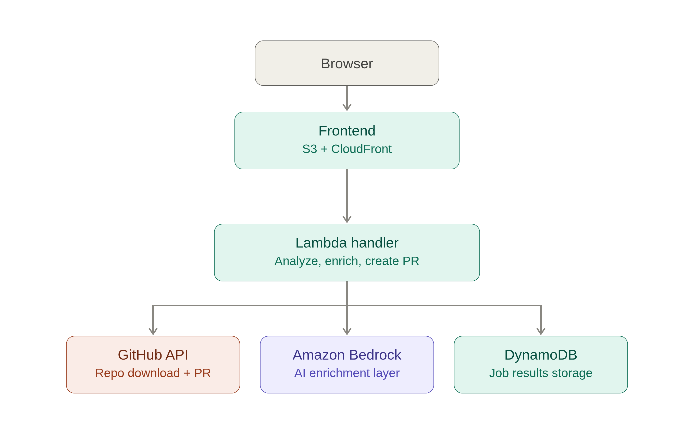

# 🎯 DeadCode Radar

> Análisis estático, afilado por IA. Encuentra código muerto en tu repo antes de que él te encuentre.

**[🚀 Pruébalo en vivo](https://d30fivs2ylbran.cloudfront.net)** · **[📹 Ver la demo](LINK_AL_VIDEO)**

## Qué hace

DeadCode Radar analiza cualquier repositorio público de GitHub en busca de archivos, exports y 
dependencias sin usar — y usa IA para explicar *por qué* cada hallazgo es (o no) un candidato 
seguro de eliminación, detectando falsos positivos que las herramientas de análisis estático 
puro no ven.

## Por qué es diferente

El análisis estático puro es ruidoso: marca handlers de rutas de Next.js, módulos cargados 
dinámicamente, y APIs re-exportadas como "muertos" cuando no lo son. DeadCode Radar enriquece 
cada hallazgo con un nivel de confianza y una explicación de riesgo en lenguaje claro — y, para 
los casos donde realmente tiene confianza, puede abrir un Pull Request real que elimina el 
código muerto por ti.

## Cómo funciona

1. **Pega la URL de un repo** — repositorios públicos de GitHub, JS/TypeScript
2. **Análisis estático** (knip/ts-prune) genera la lista cruda de archivos, exports y 
   dependencias sin usar
3. **Amazon Bedrock (Claude)** lee el contexto real de cada archivo, asigna un nivel de 
   confianza (alto/medio/bajo), agrupa hallazgos relacionados, y redacta una descripción de PR
4. **Crea un PR real** — con tu propio token de GitHub, DeadCode Radar abre un Pull Request 
   que elimina solo el código muerto de alta confianza y sin ambigüedad, dejando lo incierto 
   para revisión manual

## Arquitectura

- **AWS Lambda** — backend serverless, Node.js/TypeScript
- **Amazon Bedrock (Claude Sonnet)** — capa de enriquecimiento con IA
- **DynamoDB** — almacenamiento de resultados
- **S3 + CloudFront** — hosting del frontend
- **GitHub API (Octokit)** — descarga de repos + creación de PR

## Construido con Kiro

Todo este proyecto se construyó usando el flujo spec-driven de Kiro (requirements → design → 
tasks) a lo largo de dos días de desarrollo, más Claude Code para depuración iterativa y 
refinamiento de UI.

## Limitaciones conocidas

- La detección de `unused-dependency` requiere que el repo analizado tenga `node_modules` 
  instalado para que knip pueda resolverlo correctamente — actualmente no soportado para 
  repos remotos analizados sin un paso completo de instalación
- Los niveles de confianza para la creación de PR son generados por IA y pueden variar 
  ligeramente entre corridas sobre el mismo repo (no-determinismo del LLM) — el sistema es 
  intencionalmente conservador: ante la duda, no toca el archivo
- Actualmente solo soporta JavaScript/TypeScript

## Roadmap

- Login con GitHub OAuth (en vez de entrada manual de token)
- Soporte multi-lenguaje (Python, Go)
- Creación de PR vía fork para repos que no son tuyos

## Instalación local

### Requisitos previos
- Node.js 20.x
- AWS CLI configurado con credenciales que tengan permisos para Lambda, 
  DynamoDB, IAM, y Bedrock
- AWS CDK instalado globalmente: `npm install -g aws-cdk`
- Un Personal Access Token de GitHub (classic; el scope `public_repo` alcanza 
  para el análisis; se necesita scope `repo` si quieres probar la creación de PR)
- Acceso a Amazon Bedrock habilitado en tu cuenta/región de AWS para el 
  modelo Claude usado (inference profile `us.anthropic.claude-sonnet-4-6`)

### Opción A — Correr solo el frontend (apunta a nuestro backend en producción)

La forma más rápida de probar la UI en local sin desplegar ninguna 
infraestructura de AWS:

\`\`\`bash
git clone https://github.com/MaxTheHuman21/DeadCodeRadar.git
cd DeadCodeRadar/frontend
npm install

# El .env ya apunta a nuestro backend desplegado por defecto
npm run dev
\`\`\`

Abre `http://localhost:5173` — la app va a consumir nuestro backend real en Lambda.

### Opción B — Deploy completo (backend + frontend en tu propia cuenta de AWS)

\`\`\`bash
git clone https://github.com/MaxTheHuman21/DeadCodeRadar.git
cd DeadCodeRadar

# 1. Instala las dependencias del backend
npm install

# 2. Bootstrap de CDK (solo la primera vez por cuenta/región de AWS)
cdk bootstrap

# 3. Configura tu token de GitHub como variable de entorno
export GITHUB_TOKEN=tu_personal_access_token

# 4. Despliega el backend (Lambda, DynamoDB, permisos de Bedrock)
cdk deploy

# Anota el output FunctionUrl — lo vas a necesitar para el frontend

# 5. Configura y corre el frontend
cd frontend
npm install

# Crea un archivo .env con tu Function URL desplegada:
echo "VITE_API_URL=<tu-function-url-del-paso-4>" > .env

npm run dev       # servidor de desarrollo local
# — o —
npm run build     # build de producción, output en dist/
\`\`\`

### Correr los tests

\`\`\`bash
npx tsc --noEmit      # chequeo de tipos
npx vitest --run      # tests unitarios + property-based
cdk synth             # valida el template de CloudFormation
\`\`\`

### Referencia de variables de entorno

| Variable | Requerida | Descripción |
|---|---|---|
| `GITHUB_TOKEN` | Sí (deploy del backend) | PAT de GitHub usado como fallback para análisis de repos públicos |
| `VITE_API_URL` | Sí (frontend) | Function URL del backend (del output de CDK) |