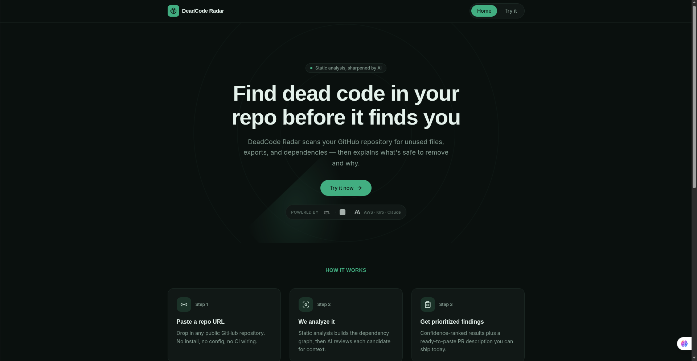

# 🎯 DeadCode Radar

> Static analysis, sharpened by AI. Find dead code in your repo before it finds you.

**[🚀 Try it live](https://d30fivs2ylbran.cloudfront.net/)** · **[📹 Watch the demo]()**

## What it does

DeadCode Radar scans any public GitHub repository for unused files, exports, and 
dependencies — then uses AI to explain *why* each finding is a safe (or risky) removal 
candidate, catching false positives that pure static analysis tools miss.

## Why it's different

Static analysis alone is noisy: it flags Next.js route handlers, dynamically-loaded 
modules, and re-exported APIs as "dead" when they're not. DeadCode Radar enriches every 
finding with a confidence score and a plain-English risk explanation — then, for the 
cases it's genuinely confident about, it can open a real Pull Request that removes the 
dead code for you.

## How it works

1. **Paste a repo URL** — public GitHub repos, JS/TypeScript
2. **Static analysis** (knip/ts-prune) builds the raw list of unused files, exports, 
   and dependencies
3. **Amazon Bedrock (Claude)** reads the actual file context around each finding, 
   assigns a confidence score (high/medium/low), groups related findings, and drafts 
   a PR description
4. **Create a real PR** — with your own GitHub token, DeadCode Radar opens a Pull 
   Request that removes only the high-confidence, unambiguous dead code — leaving 
   anything uncertain for manual review

## Architecture

**Diagram

- **AWS Lambda** — serverless backend, Node.js/TypeScript
- **Amazon Bedrock (Claude Sonnet)** — AI enrichment layer
- **DynamoDB** — job results storage
- **S3** — frontend hosting
- **GitHub API (Octokit)** — repo download + PR creation

## Built with Kiro

This entire project was built using Kiro's spec-driven workflow (requirements → design → 
tasks) across two development days, plus Claude Code for iterative debugging and UI 
refinement. [Opcional: menciona algo específico que te haya sorprendido de ese flujo]

## Known limitations

- `unused-dependency` detection requires the analyzed repo to have installed 
  `node_modules` for knip to resolve properly — not currently supported for remote 
  repos analyzed without a full install step
- PR creation confidence scores are AI-generated and can vary slightly between runs 
  on the same repo (LLM non-determinism) — the system is intentionally conservative: 
  when in doubt, it doesn't touch the file
- Currently supports JavaScript/TypeScript only

## Roadmap

- GitHub OAuth login (vs. manual PAT entry)
- Multi-language support (Python, Go)
- Fork-based PR creation for repos you don't own

## Local setup

### Prerequisites
- Node.js 20.x
- AWS CLI configured with credentials that have permissions for Lambda, 
  DynamoDB, IAM, and Bedrock
- AWS CDK installed globally: `npm install -g aws-cdk`
- A GitHub Personal Access Token (classic, `public_repo` scope is enough 
  for analysis; `repo` scope needed if you want to test PR creation)
- Access to Amazon Bedrock enabled in your AWS account/region for the 
  Claude model used (`us.anthropic.claude-sonnet-4-6` inference profile)

### Option A — Run the frontend only (points to our live backend)

The fastest way to try the UI locally without deploying any AWS 
infrastructure:

\`\`\`bash
git clone https://github.com/MaxTheHuman21/DeadCodeRadar.git
cd DeadCodeRadar/frontend
npm install

# .env already points to our deployed backend by default
npm run dev
\`\`\`

Open `http://localhost:5173` — the app will hit our live Lambda backend.

### Option B — Full deploy (backend + frontend on your own AWS account)

\`\`\`bash
git clone https://github.com/MaxTheHuman21/DeadCodeRadar.git
cd DeadCodeRadar

# 1. Install backend dependencies
npm install

# 2. Bootstrap CDK (only needed once per AWS account/region)
cdk bootstrap

# 3. Set your GitHub token as an environment variable
export GITHUB_TOKEN=your_github_personal_access_token

# 4. Deploy the backend (Lambda, DynamoDB, Bedrock permissions)
cdk deploy

# Note the FunctionUrl output — you'll need it for the frontend

# 5. Configure and run the frontend
cd frontend
npm install

# Create a .env file with your deployed Function URL:
echo "VITE_API_URL=<your-function-url-from-step-4>" > .env

npm run dev       # local dev server
# — or —
npm run build     # production build, output in dist/
\`\`\`

### Running tests

\`\`\`bash
npx tsc --noEmit      # type check
npx vitest --run      # unit + property-based tests
cdk synth             # validate CloudFormation template
\`\`\`

### Environment variables reference

| Variable | Required | Description |
|---|---|---|
| `GITHUB_TOKEN` | Yes (backend deploy) | GitHub PAT used as fallback for public repo analysis |
| `VITE_API_URL` | Yes (frontend) | Backend Function URL (from CDK output) |